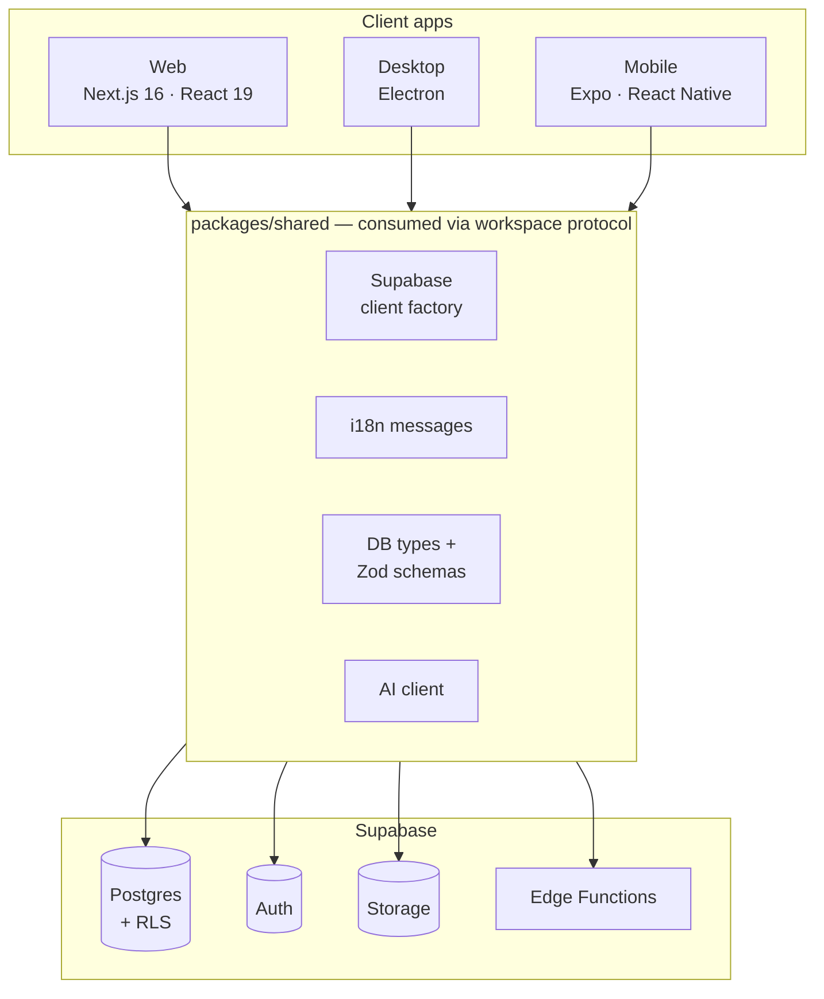

<div align="center">


# Masar X

**Modern learning platform for university students.**

Study summaries, interactive courses, quizzes, AI-powered assistance, and complete learning management — bilingual (English / العربية) by design.

[](./LICENSE)
[](./README.md#prerequisites)
[](./pnpm-workspace.yaml)
[](./README.md#project-status)
[](./README.md#project-status)
[](./README.md#project-status)

</div>

<!-- TODO: add a product screenshot below once captured, e.g.
      -->

## Table of contents

- [Features](#features)
- [Download](#download)
- [Architecture](#architecture)
- [Repository layout](#repository-layout)
- [Getting started](#getting-started)
- [Available scripts](#available-scripts)
- [Project status](#project-status)
- [Documentation](#documentation)
- [Contributing](#contributing)
- [Security](#security)
- [License](#license)

## Features

- **Learning tools** — study summaries, interactive courses, quizzes, and grade tracking for university students.
- **AI-powered assistance** — study help served through a hardened server-side boundary (provider keys never reach a client).
- **Bilingual by design** — full English/Arabic localization with RTL support via `next-intl`.
- **Cross-platform** — one Supabase backend and one shared package powering web, desktop, and mobile apps.
- **Secure foundations** — Row Level Security everywhere, secrets split by runtime, mechanical enforcement in CI (secret scanning, import restrictions, endpoint grep).
- **Type-safe end to end** — generated database types plus Zod schemas shared across every client.

## Download

Ready-to-run builds are published automatically to the public [`fotedev/masarx-releases`](https://github.com/fotedev/masarx-releases/releases) repository — this source repository hosts no installers.

| Platform | Download |
| ---------- | ---------- |
| Windows — installer | [Latest setup `.exe`](https://github.com/fotedev/masarx-releases/releases/latest) |
| Windows — portable | Portable `.exe` on the same releases page |
| Android | `.apk` will appear on the same releases page when the mobile app ships |
| Web | No download needed — runs at [masarx.vercel.app](https://masarx.vercel.app) |

The desktop app updates itself via its built-in updater (`electron-updater`); there is no need to re-download manually.

## Architecture

Masar X is a pnpm monorepo: three client apps share one backend and one cross-platform package. All provider keys (service-role, AI) stay server-side.



The web app is the source of truth for product behavior; desktop and mobile are feature-parity ports sharing the same backend and `packages/shared/` code.

## Repository layout

```text
masarx_next/
├── apps/
│   ├── web/          # Next.js 16 web app (live in production)
│   ├── desktop/      # Electron + electron-builder + electron-updater
│   └── mobile/       # Expo SDK 51 + React Native
├── packages/
│   └── shared/       # Cross-platform code: i18n messages, Supabase client
│                     # factory, database types + Zod schemas, AI client
├── supabase/         # Migrations, Edge Functions, seed data
├── docs/             # Setup guide, project context, design system
├── specs/            # Design specs (SpecKit) — one folder per spec
└── scripts/          # Repository tooling
```

## Getting started

### Prerequisites

| Requirement | Version | Notes |
| ------------- | --------- | ------- |
| Node.js | >= 24 | CI runs on Node 24; older versions are untested |
| pnpm | >= 9.15 | Pinned in `packageManager`; enable with `corepack enable` |
| Supabase project | latest | Database, auth, storage, and Edge Functions |

### Install

```bash
pnpm install
```

The workspace protocol links all apps to `packages/shared`; no per-workspace install is needed.

### Configure environment variables

Copy the template and fill in your values:

```bash
cp .env.example .env.local
```

| Variable | Required | Scope | Purpose |
| ---------- | ---------- | ----------- | --------- |
| `NEXT_PUBLIC_SUPABASE_URL` | Yes | client | Supabase project URL |
| `NEXT_PUBLIC_SUPABASE_ANON_KEY` | Yes | client | Supabase publishable key |
| `DATABASE_URL` | Yes | server only | Direct Postgres connection (Drizzle/admin) |
| `NEXT_PUBLIC_CLOUDINARY_CLOUD_NAME` | Yes | client | Image upload cloud name |
| `NEXT_PUBLIC_CLOUDINARY_UPLOAD_PRESET` | Yes | client | Unsigned upload preset |
| `NEXT_PUBLIC_SITE_URL` | Yes | client | Canonical site URL for OG tags/sitemaps |
| `NEXT_PUBLIC_GA_ID` | No | client | Google Analytics ID (`G-XXXXXXXXXX`) |
| `NEXT_PUBLIC_COLLEGE_NAME` | No | client | Institution display name in the UI |
| `VERCEL_MCP_BYPASS_SECRET` | No | server only | Auth secret for `/api/mcp` |
| `ANALYZE` | No | build | Enable Next.js bundle analyzer |

See [`.env.example`](./.env.example) for the authoritative, commented list. Never commit `.env.local`.

### Run the web app

```bash
pnpm dev            # available at http://localhost:3000
```

### Run the desktop app

```bash
pnpm dev:desktop    # Electron spawns a local Next.js server on a free port
```

### Run the mobile app

```bash
pnpm dev:mobile               # Expo dev server
pnpm --filter mobile ios      # iOS Simulator
pnpm --filter mobile android  # Android Emulator
```

### Verify your setup

```bash
pnpm typecheck      # TypeScript across all workspaces
pnpm lint           # ESLint (security-guard rules fail the build)
pnpm test           # Tests across all workspaces
```

## Available scripts

Run from the repository root:

| Command | Description |
| --------- | ------------- |
| `pnpm dev` | Start the web app dev server (alias for `dev:web`) |
| `pnpm dev:web` | Same as above, explicit |
| `pnpm dev:desktop` | Start the Electron desktop app in dev mode |
| `pnpm dev:mobile` | Start the Expo dev server |
| `pnpm build` | Production build of the web app |
| `pnpm build:desktop` | Build the desktop installer |
| `pnpm build:mobile` | Build the mobile app |
| `pnpm lint` | ESLint across configured workspaces |
| `pnpm typecheck` | TypeScript check across all workspaces |
| `pnpm test` | Test suites across all workspaces |

## Project status

| Surface | Stack | Status |
| --------- | ------- | -------- |
| Web | Next.js 16, React 19, TypeScript, Tailwind, Framer Motion | **Live in production** |
| Desktop | Electron, electron-builder, electron-updater, better-sqlite3 | In development |
| Mobile | Expo SDK 51, React Native 0.74.5 | In development |

Active design work: [specs/004-multi-platform-expansion/](./specs/004-multi-platform-expansion/spec.md) — the spec, implementation plan, task breakdown, and developer quickstart live alongside it in the same directory.

## Documentation

| Document | Contents |
| ---------- | ---------- |
| [`docs/SETUP.md`](./docs/SETUP.md) | Detailed environment setup walkthrough |
| [`docs/PROJECT_CONTEXT.en.md`](./docs/PROJECT_CONTEXT.en.md) | Product context and domain overview |
| [`specs/`](./specs/) | Design specs (one folder per spec) with plans, tasks, data models |
| [`specs/004-multi-platform-expansion/contracts/`](./specs/004-multi-platform-expansion/contracts/README.md) | Internal cross-platform contracts between the apps and the shared package |
| [`CONTRIBUTING.md`](./CONTRIBUTING.md) | How to develop in this repo: workflows, contracts, conventions |

## Contributing

Development workflows — adding a shared package, cross-platform contracts, and what CI expects before merge — are described in [CONTRIBUTING.md](./CONTRIBUTING.md).

- Report bugs with the [bug report template](./.github/ISSUE_TEMPLATE/bug_report.md) and propose ideas with the [feature request template](./.github/ISSUE_TEMPLATE/feature_request.md).
- Pull requests should follow the PR template; see [`.github/PULL_REQUEST_TEMPLATE.md`](./.github/PULL_REQUEST_TEMPLATE.md).
- Everyone participating is expected to follow the [Code of Conduct](./CODE_OF_CONDUCT.md).

## Security

Secrets are split by runtime: the service-role key and AI provider keys stay server-side, RLS policies protect all data, and CI mechanically enforces these boundaries (secret scanning on source and built artifacts, restricted imports, endpoint grep). See [SECURITY.md](./SECURITY.md) for the full policy and how to report a vulnerability.

## License

Released under the [MIT License](./LICENSE).
